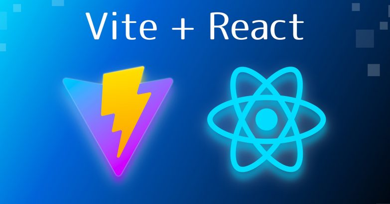

<!--lint disable awesome-heading awesome-github awesome-toc double-link -->

<p align="center">
  <br>
  
  <br>
  <br>
</p>

<h2 align='center'>Awesome Vite.js</h2>

<p align='center'>
A curated list of awesome things related to <a href='https://github.com/vitejs/vite'>Vite.js</a>
<br><br>

<a href='https://github.com/sindresorhus/awesome'>

</a>
</p>

<!--lint ignore-->
# Challenge Ivn


# DEMO
Ver github page: [https://lgcastro710.github.io/challenge-inv/](https://lgcastro710.github.io/challenge-inv/).

## Libreria 
```
Library used
- react and vite 
- tailwingcss
- tailwing-material
```

## Project setup
```
npm install
```

### run development script
```
npm run dev
```

### Compiles and minifies for production
```
npm build
```


### Customize configuration
